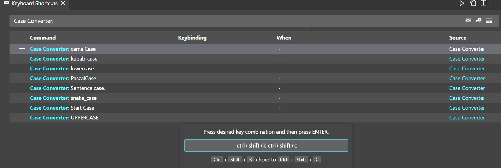

# Case Converter

Visual Studio Code extension to change text case.

## Case Converters

- UPPERCASE
- lowercase
- camelCase
- PascalCase
- snake_case
- kebab-case
- Start Case
- Sentence case.

## How to use?

### Using command palette

- Select single or multiple text blocks.
- Open Command Palette (Control+Shift+P on Windows Cmd+Shift+P on Macbook)
- Search `Case Converter: {command-name}` and select.

### With editor context menu

- Select single or multiple text blocks.
- Right click.
- Select desired `Case Converter: {command-name}` command.

## How to bind keyboard shortcuts?

- Open File ➜ Preferences ➜ Keyboard Shortcuts (Ctrl+K Ctrl+S on Windows Cmd+K Cmd+S on Macbook)
- Search for `Case Converter: {command-name}` commands.
- Enter your desired keybinding.
  
> [!NOTE]
> Make sure assigned keybinding does not conflict with an existing one.

## See Also

- [Change Log](./CHANGELOG.md)
